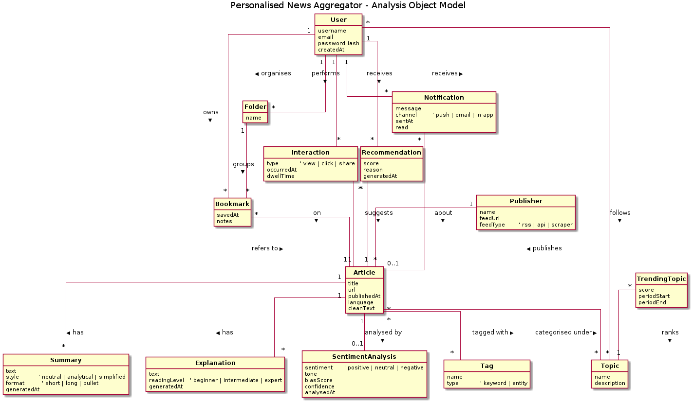
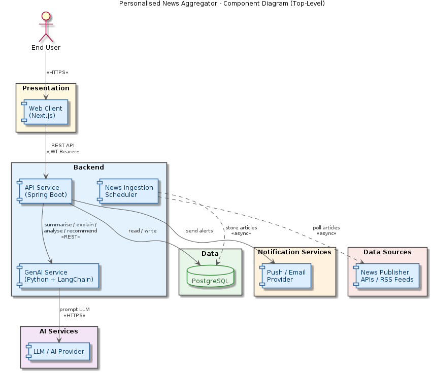

# Initial System Structure

## 1. Overview

The Personalised News Aggregator lets users follow topics and consume articles enriched by GenAI (summaries, plain-language explanations, sentiment, recommendations). The system is split into four primary deployable units — a web client, a REST API server, a GenAI microservice, and a relational database — plus a small set of supporting components and third-party integrations. Each primary unit is owned by a different layer of the request path so that scaling, debugging, and model iteration can happen independently.

## 2. Technical Decomposition

### 2.1 Web Client (Next.js)

- **Stack**: Next.js (App Router, TypeScript), React 19, Tailwind CSS v4, shadcn/ui.
- **Responsibilities**: Render the personalised feed, article view, search/filter UI, bookmark/library, notifications inbox, auth screens. Performs only presentation and lightweight client-side state — all business rules live server-side.
- **Talks to**: The API Server over HTTPS using JWT bearer tokens. It never calls the GenAI service or the database directly.
- **Why a separate deployable**: Independent release cadence (UI iterates faster than backend), CDN-friendly static + SSR output, clear security boundary between browser and authenticated APIs.

### 2.2 API Server (Spring Boot)

- **Stack**: Java 21, Spring Boot 3 (WebFlux or Web MVC), Spring Security, Spring Data JPA, Flyway/Liquibase for migrations.
- **Responsibilities**: Authentication and session management, user profile and preferences, article CRUD and search, bookmark/folder management, notification dispatch, and orchestrating GenAI requests. Holds the canonical business logic and is the only service that writes to PostgreSQL on the request path.
- **Talks to**: PostgreSQL (read/write), the GenAI Service (REST) for AI-derived content, and the external push/email provider. Receives requests from the Web Client.
- **Why a separate deployable**: Java/Spring is the right tool for transactional persistence, role-based authorisation, and large concurrent request fan-out; isolating it keeps GenAI experimentation from destabilising the persistence layer.

### 2.3 GenAI Service (Python + LangChain)

- **Stack**: Python 3.12, FastAPI (HTTP boundary), LangChain (prompt orchestration, retrieval, output parsers), Pydantic (structured I/O).
- **Responsibilities**: Generate summaries (short / long / bullet), explanations at multiple reading levels, sentiment and bias analysis, and ranking signals for recommendations. Stateless — every call carries the article text or context it needs.
- **Talks to**: Receives requests from the API Server. Sends prompts to an external LLM provider over HTTPS. Does not access PostgreSQL directly; the API Server passes in any required context and persists results.
- **Why a separate deployable**: The Python ML ecosystem (LangChain, tokenizers, embedding clients) lives most comfortably outside the JVM. Prompt iteration, model swaps, and dependency churn can happen without redeploying the API. Scaling is also different — GenAI calls are slow and concurrency-bound, so this service can scale horizontally on its own.

### 2.4 Database (PostgreSQL)

- **Stack**: PostgreSQL 16. Optional `pgvector` extension if/when we move semantic article search in-house.
- **Responsibilities**: Single source of truth for users, topics, articles (cleaned text + metadata), tags, bookmarks, folders, interactions, recommendations, notifications, and persisted GenAI artefacts (summaries, explanations, sentiment results).
- **Talks to**: Only the API Server and the News Ingestion Scheduler. The Web Client and GenAI Service never connect directly.
- **Why a separate deployable**: Standard managed-database concerns — backups, point-in-time recovery, connection pooling — and a clean enforcement boundary that the only writers are services we control.

### 2.5 Supporting Components

- **News Ingestion Scheduler**: A scheduled worker that polls publisher APIs and RSS feeds, normalises content, and persists articles. Runs off the user request path so latency spikes from upstream sources never reach the client. May ship as a Spring Boot module or a separate process; either way it shares no in-process state with the API Server.
- **External LLM Provider**: A managed model endpoint (OpenAI / Anthropic / Bedrock). Reached only via the GenAI Service, which keeps prompts, retries, and quota handling in one place.
- **Push / Email Provider**: A third-party transactional messaging service (e.g. Firebase Cloud Messaging, SES, SendGrid) used by the API Server to deliver breaking-news alerts and topic updates.

## 3. UML Diagrams

The diagrams below are authored as PlantUML in [docs/diagrams/](./docs/diagrams/) and rendered to PNG by [.github/workflows/generate_uml_diagrams.yml](./.github/workflows/generate_uml_diagrams.yml).

### 3.1 Analysis Object Model

A UML class diagram of the problem-domain entities (`User`, `Article`, `Topic`, `Tag`, `Publisher`, `Summary`, `Explanation`, `SentimentAnalysis`, `Bookmark`, `Folder`, `Interaction`, `Recommendation`, `Notification`, `TrendingTopic`) with their associations and multiplicities. Attributes only — no methods — because this is the *what*, not the *how*. Source: [docs/diagrams/analysis-object-model.puml](./docs/diagrams/analysis-object-model.puml).

### 3.2 Use Cases

A UML use case diagram covering the eleven backlog stories: account creation/login, browsing the personalised feed, viewing an article (with `<<extend>>` paths to AI summary, explanation, sentiment, and bookmarking), search & filter, recommendations, trending topics, bookmark organisation, notifications, and the automated tag/categorisation process. Two actors: an unauthenticated `Visitor` generalised by an authenticated `User`. Source: [docs/diagrams/use-case.puml](./docs/diagrams/use-case.puml).

### 3.3 Top-Level Architecture (Component Diagram)

A UML component diagram of the deployable units described in section 2 and how they connect on the request path: `End User -> Web Client (Next.js) -> API Service (Spring Boot) -> GenAI Service (Python + LangChain) -> External LLM Provider`, with the API Service also reading/writing PostgreSQL and dispatching to the push/email provider. The News Ingestion Scheduler runs asynchronously off the request path, polling publisher feeds and persisting articles. Source: [docs/diagrams/architecture-component-diagram.puml](./docs/diagrams/architecture-component-diagram.puml).
