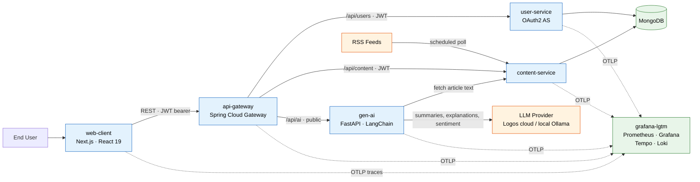

# Personalised News Aggregator

Your news, summarised and explained by GenAI — a microservices platform that aggregates RSS sources, then uses LLMs to summarise, explain, and sentiment-score every article against each reader's interests.

> TUM DevOps Project · Spring 2026 · Team The Rolling Restarts

<!-- hero screenshot of the web-client feed goes here -->

## Quick Start

```bash
cp infra/.env.example infra/.env    # fill in required values
make compose-up                     # start the full local stack
make smoke-test                     # verify endpoints
```

Full rendered docs: <https://aet-devops26.github.io/team-the-rolling-restarts/>

## Installation

Prerequisites:

- Docker + Docker Compose
- GNU Make

That's all you need to run the stack — Compose builds and wires every service. For working on an individual service outside Docker:

- **Spring services** — JDK 25 (Gradle wrapper included)
- **web-client** — Node 22
- **gen-ai** — Python ≥ 3.12

```bash
make install-hooks   # optional: pre-commit hooks
make preflight       # generate spec, build+test Spring, lint Helm, validate Terraform
```

## Project Structure

```text
.
├── api/                        # OpenAPI contract (single source of truth) + generation scripts
│   └── scripts/gen-all.sh
├── services/
│   ├── spring/                 # Gradle multi-module project
│   │   ├── api-gateway/        # Spring Cloud Gateway — routing, JWT validation, aggregated Swagger
│   │   ├── user-service/       # OAuth2 Authorization Server — auth, profiles, settings
│   │   └── content-service/    # Articles, RSS sources, topics + scheduled feed fetcher
│   └── gen-ai/                 # FastAPI + LangChain — summaries, explanations, sentiment
├── web-client/                 # Next.js + React 19 dashboard
├── infra/
│   ├── docker-compose*.yaml    # Local orchestration
│   ├── helm/                   # Kubernetes Helm chart
│   ├── k8s/                    # Raw Kubernetes manifests
│   ├── terraform/azure-vm/     # Azure VM provisioning
│   └── ansible/                # VM configuration + deployment
├── docs/                       # MkDocs documentation site
└── Makefile                    # Helper commands (run `make help`)
```

## Architecture

The web-client talks to everything through the **api-gateway** over REST (JWT bearer, except the public GenAI routes). `content-service` owns article state and runs an embedded `RssFetcherService` that polls active RSS sources on a schedule and upserts articles asynchronously, off the request path. `gen-ai` is a stateless FastAPI service that fetches article text from `content-service` and calls an LLM provider. Each Spring service owns its data in MongoDB; every service exports telemetry to a bundled Grafana LGTM stack over OTLP.

### Service communication



| Service | Stack | Port | Purpose |
| --- | --- | --- | --- |
| `web-client` | Next.js, React 19, TypeScript | 3000 | Frontend UI |
| `api-gateway` | Spring Boot, Spring Cloud Gateway | 8080 | Routing, JWT validation, aggregated Swagger UI |
| `user-service` | Spring Boot, OAuth2 AS, MongoDB | 8081 | Authentication, user profiles, settings |
| `content-service` | Spring Boot, Spring Data MongoDB | 8082 | RSS management, article storage, scheduled fetching |
| `gen-ai` | Python, FastAPI, LangChain | 8000 | AI summaries, explanations, sentiment |

UML deliverables (PlantUML, rendered on the docs site):

- [Current system structure](https://aet-devops26.github.io/team-the-rolling-restarts/CURRENT_SYSTEM_STRUCTURE/) — component, object, and use-case diagrams of the system as built
- [Initial system structure](https://aet-devops26.github.io/team-the-rolling-restarts/INITIAL_SYSTEM_STRUCTURE/) — the original design intent
- [Database schema](https://aet-devops26.github.io/team-the-rolling-restarts/database-schema/)

### GenAI

`gen-ai` is a separate, stateless FastAPI service. Its `/api/ai/**` routes are public (no JWT) and reached through the gateway. It fetches article text from `content-service`, then produces summaries, explanations, and sentiment via LangChain against a configurable provider (`LLM_PROVIDER`) — TUM Logos in the cloud or a local Ollama model for development.

### API

The API is **code-first**: the Spring controllers are the source of truth, springdoc derives `api/openapi.yaml` from them per service (merged with gateway prefixes by `api/scripts/gen-all.sh`), and the web-client (TypeScript) and gen-ai (Python) clients are generated *from* that contract. Once the stack is running:

- Swagger UI (aggregated across services): <http://localhost:8080/swagger-ui.html>
- Raw OpenAPI spec: <http://localhost:8080/v3/api-docs>
- Static rendered reference: [API Docs](https://aet-devops26.github.io/team-the-rolling-restarts/api.html)

`make generate` regenerates the spec and both client SDKs. See the [OpenAPI workflow](https://aet-devops26.github.io/team-the-rolling-restarts/openapi-workflow/).

## CI/CD

All workflows live in [.github/workflows/](.github/workflows/). Every push and PR runs `ci.yml`; merges to `main` additionally trigger the deploy pipelines.

| Workflow | Trigger | Purpose |
| --- | --- | --- |
| `ci.yml` | Push, PR | Build + test all services, regenerate & lint OpenAPI, `terraform validate`, `helm lint` |
| `upload_images.yml` | Push | Build & push multi-arch Docker images to GHCR |
| `deploy_kubernetes.yml` | Images built on `main`, or dispatch | `helm upgrade --install` to the Kubernetes cluster |
| `deploy_monitoring.yml` | Push touching monitoring files, or dispatch | Lighter redeploy of just the Grafana/Prometheus stack |
| `deploy-azure.yml` | Push to `main`, or dispatch | Build images to ACR, deploy to Azure VM via `az vm run-command` |
| `publish_docs.yml` | Push to `main`/`dev`, or dispatch | Render PlantUML + OpenAPI reference, deploy the docs site to GitHub Pages |

Security scanning (`gitleaks`, `hadolint`, `kics`, `zizmor`, `typos`, `npm audit`, `trivy`, `dockle`) runs via `make security-scan` — see [Security Scanning](https://aet-devops26.github.io/team-the-rolling-restarts/security-scanning/).

## Testing

```bash
# Everything (compile + test all services)
make spring-build            # Spring services (Gradle)
(cd web-client && npm ci && npm test)
(cd services/gen-ai && pip install -e ".[dev]" && pytest)

# Full-stack smoke test against a running compose stack
make compose-up
make smoke-test
```

## Local Runtime

`make compose-up` starts the full stack from `infra/docker-compose.yaml` + `docker-compose.dev.yaml`, reading `infra/.env`. Stop it with `make compose-down`; tail logs with `make compose-logs`.

| URL | Service |
| --- | --- |
| `http://localhost:3000/` | web-client (frontend) |
| `http://localhost:8080/swagger-ui.html` | Swagger UI (via gateway) |
| `http://localhost:8080/v3/api-docs` | Raw OpenAPI spec |
| `http://localhost:8000/docs` | gen-ai FastAPI docs |

Grafana / Prometheus access differs per deployment target — see [Monitoring](https://aet-devops26.github.io/team-the-rolling-restarts/monitoring/).

## Deployment

| Target | Path |
| --- | --- |
| **Local** | Docker Compose (`make compose-up`) |
| **Azure VM (CI/CD)** | GitHub Actions → ACR → `az vm run-command` |
| **Azure VM (manual)** | Terraform → Ansible → Docker Compose (`make deploy-azure`) |
| **Kubernetes (CI/CD)** | GitHub Actions → GHCR → Helm (`deploy_kubernetes.yml`) |
| **Kubernetes (manual)** | Helm chart (`infra/helm/`) or raw manifests (`infra/k8s/`) |

Full runbooks live on the [docs site](https://aet-devops26.github.io/team-the-rolling-restarts/).

## Monitoring

Metrics, dashboards, and alerts run on a bundled Prometheus + Grafana stack (`grafana/otel-lgtm`: Mimir + Tempo + Loki). Every service exports over OTLP; the web-client exports traces via `@vercel/otel`. See [Monitoring](https://aet-devops26.github.io/team-the-rolling-restarts/monitoring/) for what's provisioned in each target.

## Troubleshooting

| Symptom | Resolution |
| --- | --- |
| Compose won't start | Start Docker, then confirm `infra/.env` exists (`cp infra/.env.example infra/.env`). |
| A local port is already in use | Stop the process using it, or run `make compose-down` to tear down the stack. |
| `make smoke-test` fails right after start | Services are still booting — retry, and check `make compose-logs`. |
| `401` on `/api/content` requests | Those routes need a JWT — authenticate via `user-service` first (`/api/ai` is public). |
| GenAI returns no summaries | `LLM_PROVIDER` isn't configured — check the `gen-ai` env in `infra/.env`. |

## Team & responsibilities

Two active members (originally three — the third left the project). Each owns a primary subsystem but collaborates across boundaries for integration, deployment, and debugging. Enforced via [`.github/CODEOWNERS`](.github/CODEOWNERS).

- **web-client + GenAI** (`web-client`, `services/gen-ai`): [@brscn2](https://github.com/brscn2)
- **Spring backend + GenAI** (`services/spring`, `services/gen-ai`): [@YRC99](https://github.com/YRC99)

Infra, CI/CD, the API contract, and docs (`infra/`, `.github/`, `api/`, `docs/`) are jointly owned.
