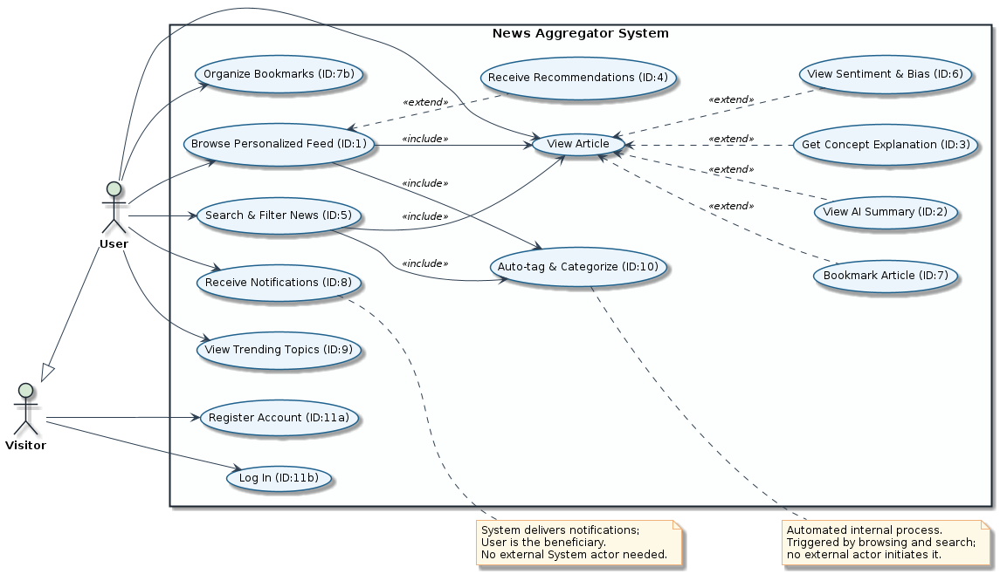

# Initial System Structure

## 1. Overview

The Personalised News Aggregator lets users follow topics and consume articles enriched by GenAI (summaries, plain-language explanations, sentiment, recommendations). The system is split into six primary deployable units — a web client, an API gateway, a user service, a content service, a GenAI microservice, and backing databases — plus a small set of supporting components and third-party integrations. Each primary unit is owned by a different layer of the request path so that scaling, debugging, and model iteration can happen independently.

## 2. Technical Decomposition

### 2.1 Web Client (Next.js)

- **Stack**: Next.js (App Router, TypeScript), React 19, Tailwind CSS v4, shadcn/ui.
- **Responsibilities**: Render the personalised feed, article view, search/filter UI, bookmark/library, notifications inbox, auth screens. Performs only presentation and lightweight client-side state — all business rules live server-side.
- **Talks to**: The API Server over HTTPS using JWT bearer tokens. It never calls the GenAI service or the database directly.
- **Why a separate deployable**: Independent release cadence (UI iterates faster than backend), CDN-friendly static + SSR output, clear security boundary between browser and authenticated APIs.

### 2.2 API Gateway (Spring Boot)

- **Stack**: Java 25, Spring Boot 4.0.6 (Web MVC), Spring Cloud Gateway (WebMvc), Spring Security (OAuth2 Resource Server), springdoc-openapi.
- **Responsibilities**: Routes external requests to downstream microservices (`/api/users/**` → user-service, `/api/content/**` → content-service). Validates JWT tokens issued by the user-service. Aggregates OpenAPI documentation from all services into a single Swagger UI. Hosts backwards-compatible test endpoints (`/`, `/test`, `/dummy`).
- **Talks to**: User Service, Content Service. Receives requests from the Web Client.
- **Why a separate deployable**: Keeps routing, rate limiting, and token validation in a single entry point. Individual services can be scaled, deployed, and debugged independently behind the gateway.

### 2.3 User Service (Spring Boot)

- **Stack**: Java 25, Spring Boot 4.0.6 (Web MVC), Spring Security OAuth2 Authorization Server, Spring Data JPA, PostgreSQL.
- **Responsibilities**: OAuth2 Authorization Server (issues JWT tokens). User registration, authentication, profile management, and user preferences (selected topics, enabled sources, saved article IDs).
- **Talks to**: PostgreSQL. Receives requests from the API Gateway.
- **Why a separate deployable**: Authentication and user management have a distinct data model (relational), security boundary, and release cadence from content ingestion.

### 2.4 Content Service (Spring Boot)

- **Stack**: Java 25, Spring Boot 4.0.6 (Web MVC), Spring Data MongoDB, Spring Security (OAuth2 Resource Server), Rome (RSS parsing).
- **Responsibilities**: RSS feed source management (users can submit new feed URLs, deduplicated across subscribers). Scheduled polling of active RSS feeds. Article storage, retrieval, and pagination. Topic categorisation.
- **Talks to**: MongoDB (`content` database). Receives requests from the API Gateway. Validates JWT tokens issued by user-service.
- **Why a separate deployable**: Content ingestion is I/O-heavy and benefits from independent scaling. The document-oriented data model (articles, sources) maps naturally to MongoDB, while user data is relational.

All three Spring Boot services share a Gradle multi-module project at `services/spring/`, with generated OpenAPI code in a common `generated` library subproject.

### 2.5 GenAI Service (Python + LangChain)

- **Stack**: Python 3.12, FastAPI (HTTP boundary), LangChain (prompt orchestration, retrieval, output parsers), Pydantic (structured I/O).
- **Responsibilities**: Generate summaries (short / long / bullet), explanations at multiple reading levels, sentiment and bias analysis, and ranking signals for recommendations. Stateless — every call carries the article text or context it needs.
- **Talks to**: Receives requests from the API Server. Sends prompts to an external LLM provider over HTTPS. Does not access PostgreSQL directly; the API Server passes in any required context and persists results.
- **Why a separate deployable**: The Python ML ecosystem (LangChain, tokenizers, embedding clients) lives most comfortably outside the JVM. Prompt iteration, model swaps, and dependency churn can happen without redeploying the API. Scaling is also different — GenAI calls are slow and concurrency-bound, so this service can scale horizontally on its own.

### 2.6 Database (PostgreSQL & MongoDB)

- **Stack**: PostgreSQL (user-service) and MongoDB (content-service). Optional `pgvector` extension if/when we move semantic article search in-house.
- **Responsibilities**: PostgreSQL is the source of truth for users, settings, and auth state. MongoDB (database: `content`) stores articles, RSS sources, and topics.
- **Talks to**: PostgreSQL is accessed only by user-service. MongoDB is accessed only by content-service. The Web Client and GenAI Service never connect directly.
- **Why a separate deployable**: Standard managed-database concerns — backups, point-in-time recovery, connection pooling — and a clean enforcement boundary that the only writers are services we control.

### 2.7 Supporting Components

- **News Ingestion Scheduler**: A scheduled component within content-service (`RssFetchScheduler`) that periodically polls active RSS feeds, normalises content, deduplicates by URL, and persists new articles. Runs off the user request path so latency spikes from upstream sources never reach the client. Each source is fetched once and shared across all subscribed users.
- **External LLM Provider**: A managed model endpoint (OpenAI / Anthropic / Bedrock). Reached only via the GenAI Service, which keeps prompts, retries, and quota handling in one place.
- **Push / Email Provider**: A third-party transactional messaging service (e.g. Firebase Cloud Messaging, SES, SendGrid) used by the API Server to deliver breaking-news alerts and topic updates.

## 3. UML Diagrams

The diagrams below are authored as PlantUML in [docs/diagrams/](./diagrams/) and rendered to PNG by [.github/workflows/generate_uml_diagrams.yml](../../.github/workflows/generate_uml_diagrams.yml).

### 3.1 Analysis Object Model

A UML class diagram of the problem-domain entities (`User`, `Article`, `Topic`, `Tag`, `Publisher`, `Summary`, `Explanation`, `SentimentAnalysis`, `Bookmark`, `Folder`, `Interaction`, `Recommendation`, `Notification`, `TrendingTopic`) with their associations and multiplicities. Attributes only — no methods — because this is the *what*, not the *how*. Source: [docs/diagrams/analysis-object-model.puml](./diagrams/analysis-object-model.puml).

### 3.2 Use Cases

A UML use case diagram covering the eleven backlog stories: account creation/login, browsing the personalised feed, viewing an article (with `<<extend>>` paths to AI summary, explanation, sentiment, and bookmarking), search & filter, recommendations, trending topics, bookmark organisation, notifications, and the automated tag/categorisation process. Two actors: an unauthenticated `Visitor` generalised by an authenticated `User`. Source: [docs/diagrams/use-case.puml](./diagrams/use-case.puml).

### 3.3 Top-Level Architecture (Component Diagram)

A UML component diagram of the deployable units described in section 2 and how they connect on the request path: `End User -> Web Client (Next.js) -> API Gateway (Spring Boot) -> User Service / Content Service -> GenAI Service (Python + LangChain) -> External LLM Provider`, with user-service reading/writing PostgreSQL and content-service reading/writing MongoDB. The News Ingestion Scheduler runs within content-service asynchronously off the request path, polling RSS feeds and persisting articles. Source: [docs/diagrams/architecture-component-diagram.puml](./diagrams/architecture-component-diagram.puml).
